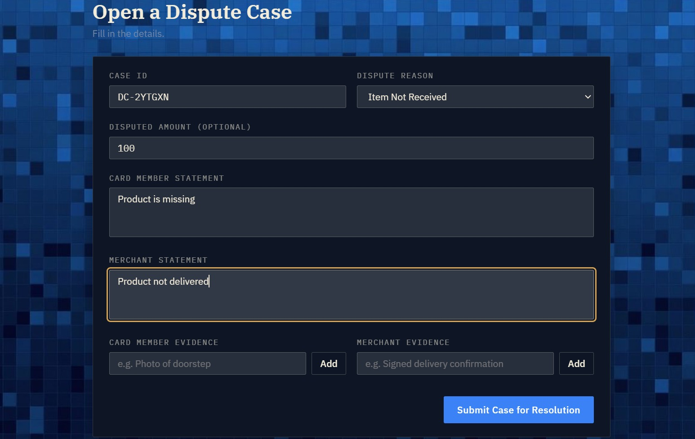
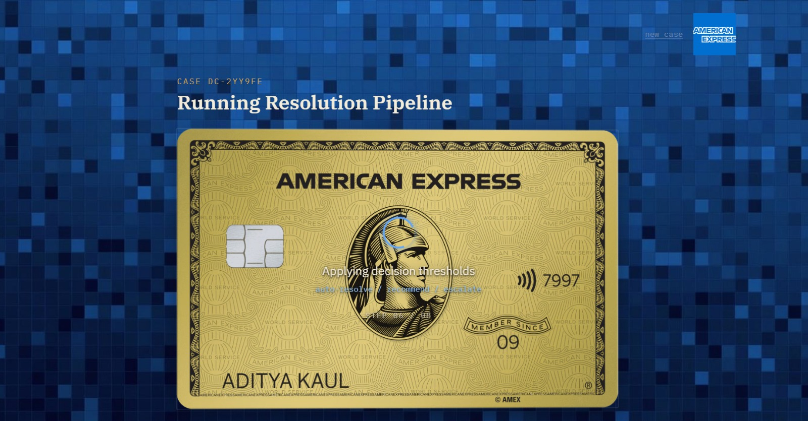
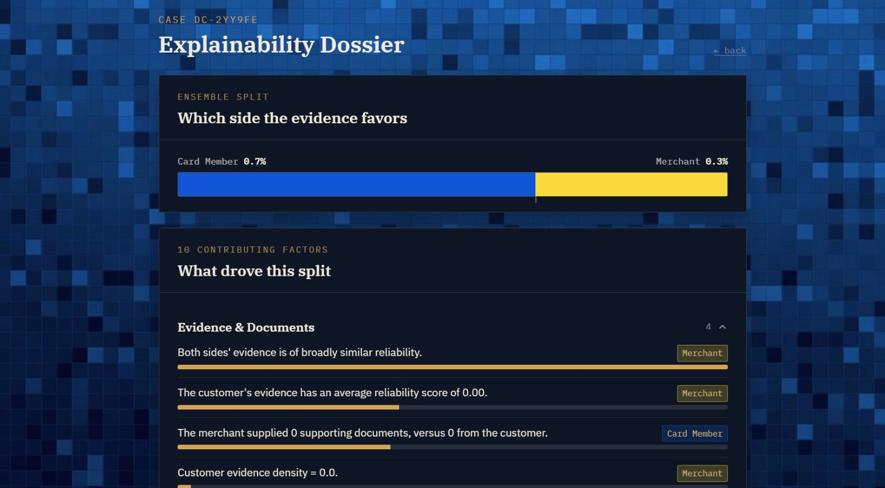
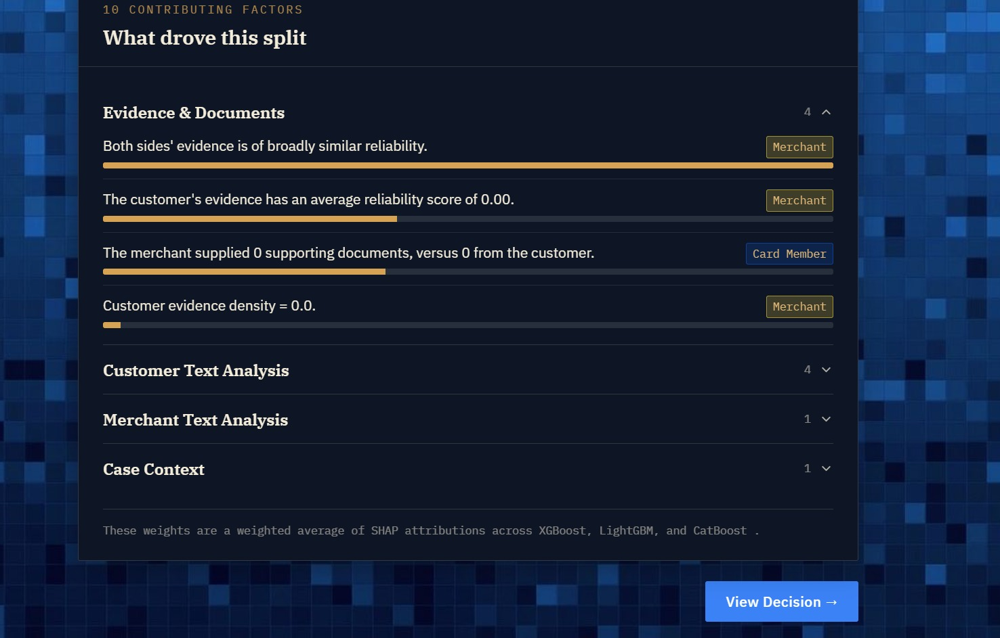
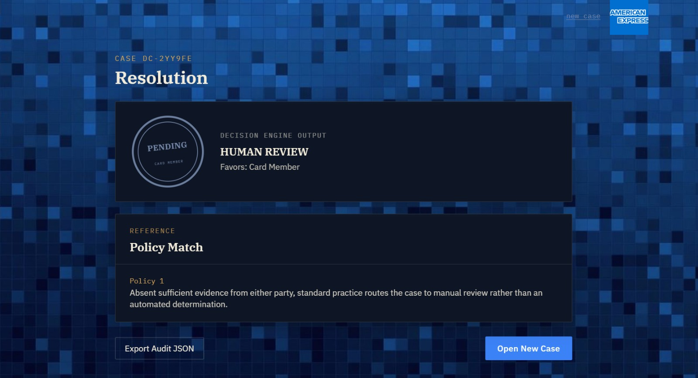

# Frictionless Dispute & Chargeback Resolution

Transparent, Explainable AI for Automated Card Dispute Resolution

An end to end AI powered dispute resolution platform that assists financial institutions in resolving chargeback disputes faster, more consistently, and with complete transparency.

Instead of relying entirely on manual investigation, our system analyzes customer and merchant evidence, detects contradictions, evaluates supporting documents, predicts the most likely dispute outcome, explains every prediction using SHAP, and determines whether a dispute should be automatically resolved, recommended to an investigator, or escalated for manual review.

## Features

### AI Powered Dispute Analysis

* Customer and Merchant evidence submission
* Automated evidence parsing
* Contradiction detection using Natural Language Inference (NLI)
* Feature engineering from structured and unstructured evidence

### Explainable Machine Learning

* Weighted Ensemble Model
  * XGBoost
  * LightGBM
  * CatBoost
* Individually calibrated models
* SHAP explainability for every prediction
* Human readable reasoning behind each decision

### Intelligent Decision Engine

* Auto Resolve (High Confidence)
* Recommended Resolution (Medium Confidence)
* Human Escalation (Low Confidence)

### Case Intelligence

* Similar case retrieval using TF IDF and Cosine Similarity
* Policy snippet matching
* Complete audit trail generation

### Interactive Dashboard

* Dispute Submission
* Pipeline Visualization
* Explainability Dashboard
* Decision Dashboard
* Fairness Metrics
* Audit Export

## System Architecture

```text
Customer & Merchant Evidence
            │
            ▼
spaCy NER + Regex Parsing
            │
            ▼
Natural Language Inference
            │
            ▼
Feature Engineering (85 Features)
            │
            ▼
Weighted Ensemble
(XGBoost + LightGBM + CatBoost)
            │
            ▼
Probability Calibration
            │
            ▼
SHAP Explainability
            │
            ▼
Decision Engine
            │
      ┌─────┼─────┐
      ▼     ▼     ▼
Auto  Recommend  Escalate
```

## Machine Learning Pipeline

### Evidence Parsing

* spaCy Named Entity Recognition
* Regex extraction
* Dates
* Amounts
* Organizations
* Tracking IDs
* Order IDs

### Contradiction Detection

A pretrained NLI Cross Encoder compares customer and merchant statements and predicts:

* Entailment
* Neutral
* Contradiction

### Feature Engineering

The system builds an 85 dimensional feature vector including:

* Evidence reliability
* Evidence counts
* Monetary overlap
* Tracking number overlap
* Keyword frequency
* Negation statistics
* Timeline consistency
* NLI scores
* Difference features

### Weighted Ensemble Model

Predictions are generated using a weighted ensemble consisting of:

* XGBoost
* LightGBM
* CatBoost

Each model is trained independently, calibrated individually, and combined using optimized ensemble weights.

### Explainability

Every prediction is accompanied by SHAP explanations showing:

* Most influential evidence
* Positive contributors
* Negative contributors
* Confidence score
* Plain English reasoning

### Decision Engine

| Confidence | Action |
|------------|--------|
| High | Auto Resolve |
| Medium | Recommended Resolution |
| Low | Escalate to Human Investigator |

## Technology Stack

### Backend

* FastAPI
* Python
* spaCy
* Transformers
* SHAP
* XGBoost
* LightGBM
* CatBoost
* Scikit learn
* Pandas
* NumPy

### Frontend

* React
* JavaScript
* CSS

### Machine Learning

* Natural Language Inference
* Named Entity Recognition
* Ensemble Learning
* Explainable AI
* TF IDF Retrieval
* Probability Calibration

## Project Structure

```text
project/
├── backend/
│   ├── model_artifacts/
│   ├── app.py
│   ├── main.py
│   ├── parser.py
│   ├── nli_checker.py
│   ├── features.py
│   ├── explainability.py
│   ├── model.py
│   ├── train_model.py
│   ├── dispute_xgboost_model.json
│   ├── disputes_dataset_300.json
│   ├── label_encoder.json
│   └── requirements.txt
│
├── frontend/
│   ├── public/
│   ├── src/
│   │   ├── api/
│   │   │   └── disputeApi.js
│   │   ├── components/
│   │   │   ├── SubmissionScreen.jsx
│   │   │   ├── PipelineScreen.jsx
│   │   │   ├── ExplainabilityScreen.jsx
│   │   │   ├── DecisionScreen.jsx
│   │   │   └── ...
│   │   ├── hooks/
│   │   ├── theme/
│   │   ├── App.jsx
│   │   ├── main.jsx
│   │   └── index.css
│   ├── index.html
│   └── .env.example
```

## API Endpoints

### POST /resolve

Runs the complete dispute resolution pipeline and returns:

* Prediction
* Confidence
* SHAP explanation
* Similar cases
* Policy match
* Audit object

### GET /fairness

Returns model evaluation metrics.

### GET /health

Health check endpoint.

## Current Capabilities

* Evidence Parsing
* Contradiction Detection
* Feature Engineering
* Weighted Ensemble Prediction
* SHAP Explainability
* Decision Engine
* Similar Case Retrieval
* Policy Matching
* REST API
* Interactive React Dashboard

## Screenshots

### 1. Dispute Submission

The submission portal allows investigators to enter customer and merchant statements, dispute details, and supporting evidence before initiating the automated resolution pipeline.

<p align="center">
  
</p>

### 2. Resolution Pipeline

Displays the live execution of the AI pipeline as the system processes evidence, performs contradiction analysis, generates features, and produces a prediction.

<p align="center">
  
</p>

### 3. Explainability Dashboard

Provides an overview of the ensemble prediction, showing which side the evidence favors along with SHAP-based feature attribution.

<p align="center">
  
</p>

### 4. Feature Attribution

Displays the most influential factors contributing to the prediction, grouped by evidence quality, customer text, merchant text, and overall case context.

<p align="center">
  
</p>

### 5. Final Resolution

Shows the decision generated by the decision engine, matched policy reference, and provides an option to export the complete audit trail.

<p align="center">
  
</p>

## Future Improvements

* Semantic retrieval using sentence embeddings
* OCR for invoices and receipts
* PDF evidence ingestion
* Human reviewed production dataset
* Multi language support
* Continuous learning and model monitoring
* Cloud deployment
* Banking and payment network integrations

## Team

Team ERROR404

* Angelica Das
* Avani Goyal

## License

Developed as part of the American Express Hackathon for educational and research purposes.
